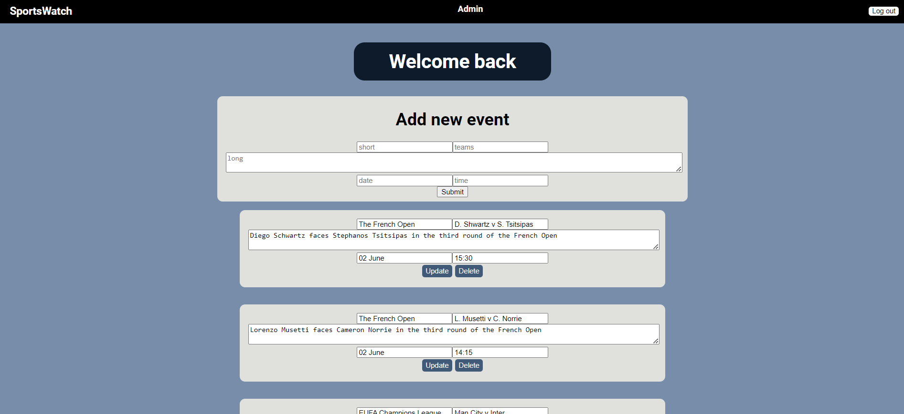

# Fullstack sports fixtures app

## Description

This sports fixtures app requires a user to sign up and log in with a username and password. Once the user signs in with their account details they will have access to upcoming sports fixtures which will tell them which events are being played, which teams are playing, a short description of the match, as well as the date and time of the match. The users will be able to save a fixture to a "favourites" tab which they can view separately.

### Usage

To start the app, run "npm install" for the frontend and the backend in the terminal. Once the node modules are installed you can type npm start in the terminal of both the backend and frontend to start the application.
The connection to the database(URI) is specified in the server so it does not need to be modified.

If you would like to log into an account, you can use:
username: 123@gmail.com
password: password
Or if you want to log into the admin account you can use:
username: test@gmail.com
password: password
Otherwise you can make an account yourself using the sign up function (username needs to end in @gmail.com) and log into that account once your account has been saved.

The admin account has the ability to add new fixtures to the app, update details about fixtures and delete fixtures (CRUD). When the admin makes any changes they will be saved to the database.

### Technologies used

This app makes use of express for the server, MongoDB for the database and React for the frontend. The database stores the sports fixtures in one collection and the users accounts in another collection.

Measures I have taken to ensure security of this app include using Helmet which is a middleware that adds or removes HTTP headers as well as make use of jsonwebtoken which securely sends and receives data between the database and server.

I have made use of renderer as well as mocha and chai for the testing of this app. To test, type npm test in the terminal and if you want to do the snapshot test you will need to change the package.json file under "scripts" and change the value of "test" to "react-scripts test".

### Deployment

Unfortunately, due to Heroku not having a free service anymore I am unable to deploy this app.

### Screenshot

Screenshot of the applications log in/sign up screen 

Screenshot of the applications UI once logged in 

Screenshot of the applications UI logged in as an admin 
